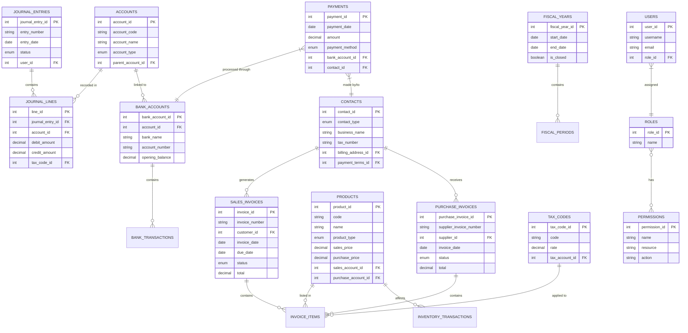

# accounting-software

## PHASE 1: Brainstorm and build a simplified version of accounting software
- The database design

- **Challenges**: Ensure that multiple related transactions are processed concurrently. For example, when a sales invoice is recorded, multiple accounts including sales account, AR account, COGS, and inventory are affected.
- **Solution Options**:
    - Add function to validate double-entry to ensure journal entries are balanced
    - Event-driven architecture?
    - Consider building each module separately and connecting via APIs (Microservices approach)
        - **Advantages**: Flexibility of tech stack chosen for each module, single point of failure avoided, separation of concerns and assignments. To implement this, need to think about database design (should each module have a separate db?). In pure microservices, each service should own its own db.
        - **Disadvantages**: Database systems don't support foreign keys that reference tables in other databases
            - **Solution**: Store reference IDs without actual database constraints, duplicate necessary data to avoid cross-service queries, use events, or create a higher-level service that coordinates across domains.
- **Phase 1**:
    - Create a simple app with sales/purchase recording buttons
    - Basic input form for amount and description
    - Preview of double-entry before confirming
    - Update account balances when transactions are recorded
    - Product entity with basic details
    - Dropdown selection of product when recording transaction
    - Auto inventory quantity adjustment
    - Basic reporting of product quantity
    - Basic check if debits equal credits
    - Incorporate AI as much as possible and test around
- **Phase 2**:
    - Create a more flexible chart of accounts structure
    - Basic financial reporting: simple trial balance, P&L, balance sheet
    - Filter transactions by date
- **Phase 3**:
    - Add contacts module with customer/vendor database
    - Track outstanding balances
    - Add aging reports
- **Phase 4**:
    - Implement banking transactions and reconciliation
    - BAS (Business Activity Statement) generation
    - Add more tax details
### Learning Notes
- **Sequelize library**: Model basics - define model, data types, options for setting createdAt and updatedAt manually, associations with other models (belongsTo, hasMany), sync model, drop model, add foreign key, how Sequelize sets table names and field names
- **Node.js**: How to build and publish your own npm library - bin/cli.js, package.json settings (need to do more projects on this!)
- **Phase 1 progress**: Set up Node.js project with Express.js, Sequelize, dbConfig to define and connect to database, create models folder and define basic accounting models and their relationships, sync models to create database tables if they don't exist
